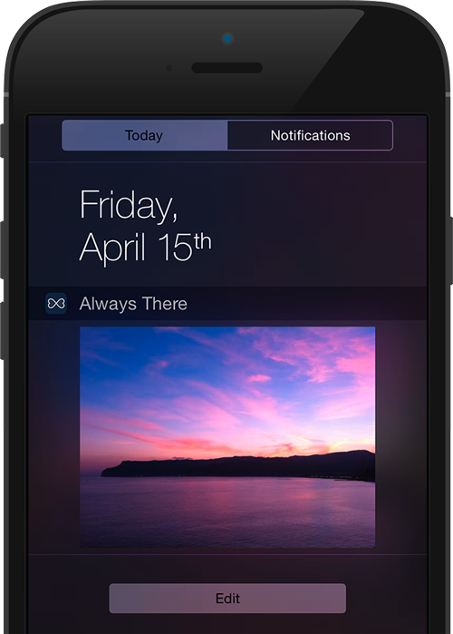

<!-- Main -->

<section id="one" class="spotlights">
	<section>
		

			
		

		

			

				
<i>Warning: Always There has been retired and removed from the iOS App Store on March 10, 2020. I am keeping this page online, without modifications, for historic (nostalgic) reasons...</i>
 
				
Some pictures mean the world to us: a photo of your loved ones, a shot of your cat, a special memory, an inspiring panorama... You want your most precious photo always with you, always there to inspire you and make you smile.  <b>Always There does just that: choose an image you love, just one, from your Photo Library and tap a button. Now that special picture will be available for you whenever you want, in a Notification Center widget of your iPhone or iPad.</b>  You can change photo every time you want, and keep a different picture on every device you own. Always There is a small app with a simple, yet important purpose: keep that photo you love always there for you, so that you can just pull down Notification Center and see it every time you want to feel that warm fuzzy feeling.
				 
				

					
				
