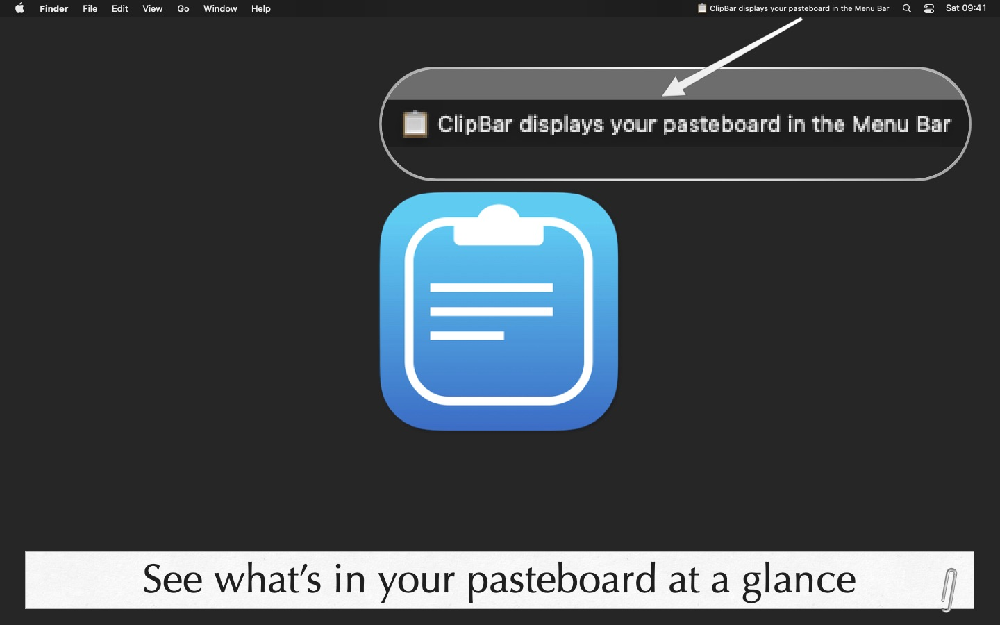

<!-- Main -->

<!-- One -->
<section id="one">
	

		
<b>ClipBar lives in the upper right corner of your Mac and shows what's currently in your pasteboard.</b>  If you have ever put your fingers on the CMD-V keys and stopped wondering what you were going to paste, ClipBar is the small menu bar utility for you.  The app main purpose is to allow you to <b>quickly check the text you're going to paste</b>, but ClipBar also shows if the pasteboard is currently holding an image (giving you its size) or a file (showing you the path). And when you click on ClipBar, a popover will appear for viewing a larger preview of your untruncated clipboard's content (from which you can extract part of the text or file path), or to actually view the image currently in your pasteboard.  We copy and paste stuff so many times every day, and yet having the ability to see at a glance what's in the pasteboard before actually pasting it <b>will make you faster and more accurate</b>.

		

			
		

	

</section>

<!-- Two -->
<section id="two" class="spotlights">
	<section>
		

			
		

		

			

				
Handling your pasteboard data is a sensitive matter, and ClipBar takes this responsibility seriously: the app does not persistently store the content of your pasteboard, doesn't connect to the Internet, doesn't include 3rd party frameworks of any kind (no analytics or other prying stuff) and is completely sandboxed.  <b>Before installing and using ClipBar, you must assess if displaying the content of your pasteboard on screen is acceptable for you</b>:  ClipBar shows whatever is your current pasteboard content in the Menu Bar; this might include sensible informations, such as passwords, shown in plain text on screen.  For additional informations, and before using the app, please review ClipBar's <a href="{{ site.baseurl }}/privacy/clipbar_terms_of_service_and_privacy_policy.html">Terms of Service and Privacy Policy</a>) and <a href="mailto:support@cdf1982.com">get in touch</a> if you need any additional clarifications.
				

			

		

	</section>
	
<!-- Three -->
<section id="three" class="spotlights">
	

		
	

		

			

				

					ClipBar is not a clipboard manager – there's a lot of great apps that do that well already – but it can complement any third party solution you use to manage your pasteboard.  The app can <b>launch automatically at login</b> and you can <b>configure the maximum length of the text preview, and if longer strings should be truncated at the beginning, in the middle or the end</b>. If you hover your mouse on the Menu Bar item, you will get a full, untruncated preview even for longer texts and file paths. And you can also share your pasteboard's content to other apps directly from ClipBar's popover!  ClipBar is at home on <b>Big Sur</b> and is built natively for <b>Apple Silicon</b>, but it is also compatible with previous versions of macOS (it requires version <b>10.14 Mojave or newer</b>) and <b>older Intel Macs</b>.
				

			

		

</section>
	
<section id="four" class="spotlights">
	

		
		

				

					

						ClipBar is an indie product that does not include in-app purchases or subscriptions.<b>  You just buy the app once for, dare I say, a very convenient price and keep it forever on all your Macs</b> while also supporting its future development.  Support is available from the developer - me, Cesare - at <a href="mailto:support@cdf1982.com">support@cdf1982.com</a> and your reviews and word of mouth are really, really appreciated!  
					

				

			

		

</section>
