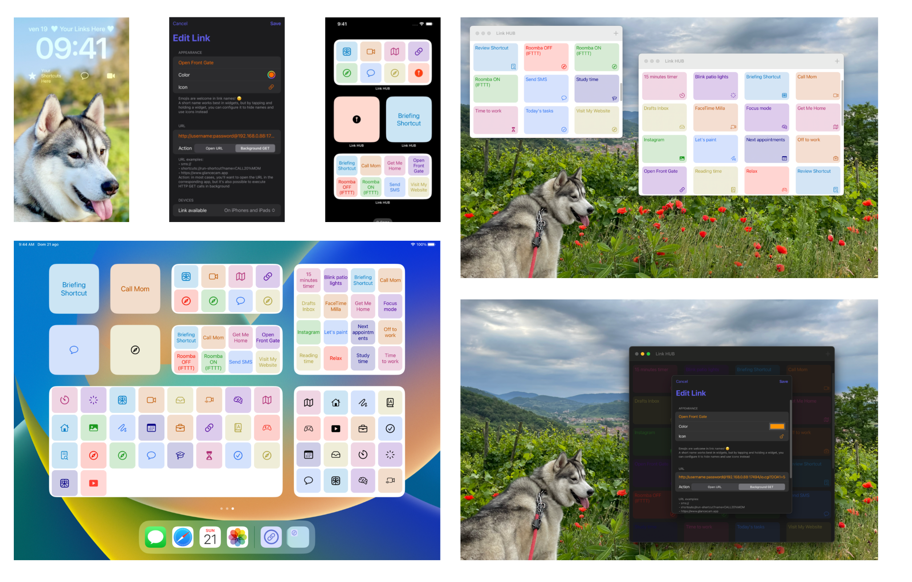

<!-- Main -->

<!-- One -->
	<section id="one">
		

			

				Links are powerful: they open websites, allow to launch apps and Shortcuts, call friends and trigger any kind of automation.  If something has a URL, <b><a href="https://apps.apple.com/us/app/id1524351956">Link HUB</a> can give you a button, widget or lock-screen widget to launch it at the speed of light</b>: just set a name, paste a valid address, pick an icon and color and you're done!  Link HUB is your <b>dashboard to quickly launch links on iPhone, iPad and Mac</b>: visit websites, run specific Shortcuts, deep-link into apps, execute web-based automations, open pages you visit often in Safari instead of native apps such as  YouTube, Instagram of Facebook...  Link HUB also offers <b>every widget size available, each one with super-high density</b>: while the small widget is a big convenient button for just one link, a medium widget can contain up to 8 links, a large one 16 and the extra-large widget on iPads makes 32 links available to you... that's double of what most alternatives offer! And with <b>lock-screen widgets on iOS 16</b>, the apps and Shortcuts you rely upon the most are only <i>one tap away</i>, in any moment. Unlock a level of speed and productivity that couldn't even be imagined before!  The only requirement is for you to have important links, automations, apps and web hooks you want to access quickly and to know their specific URLs: with infinite websites and apps providing a URL scheme out there, Link HUB cannot provide a list for you to pick from, and lets you type in anything you want instead. Searching for URL schemes online is usually pretty effective, and most web-services automations like IFTTT or Zapier let you copy fully functional URLs and web hook links.  You can also configure Link HUB for people you love who are less familiar with technology than yourself, and give them a single place, with easy to tap buttons, to execute multiple operations, including non-trivial ones.  Another cool feature of Link HUB is the ability to <b>open a specific URL when you interact with a NFC tag</b> that the app previously encoded, allowing any kind of automation you can imagine. You can find out more informations about this amazing capability in the <b><a href="{{ site.baseurl }}/link-hub/link-hub_nfc_faq">Link HUB NFC Frequently Asked Questions</a></b>. Please be advised that NFC support is currently available only on iPhones, due to the need of hardware not included in Macs and iPads.  Finally, and getting even nerdier, not only can Link HUB launch your URLs, but it can also perform HTTP GET calls... great for executing home automations such as triggering an Ethernet relay that opens a gate!  <b>Link HUB is a modern macOS, iOS and iPad OS app</b> (on the latter, with multitasking, iPadOS 16's Stage Manager and drag and drop support), <b>free to use for up to 4 links.</b>  Thanks to iCloud, <b>your links sync automatically between devices while staying 100% private.</b> And you can decide that some links must be visible only on specific devices!  <b>Link HUB is secure: no analytics or prying access to your data</b>: this indie app's sustainability and future development come exclusively from an optional and very inexpensive subscription, when you decide you want unlimited buttons and NFC support; one subscription includes all your devices: iPhones, Macs and iPads. More details in the <a href="{{ site.baseurl }}/privacy/linkhub_privacy_policy.html">Privacy Policy</a> and <a href="{{ site.baseurl }}/privacy/linkhub_terms_of_service.html">Terms of Service</a>.
			

		
			

				
				
				
			

			

	</section>
	
	
	

