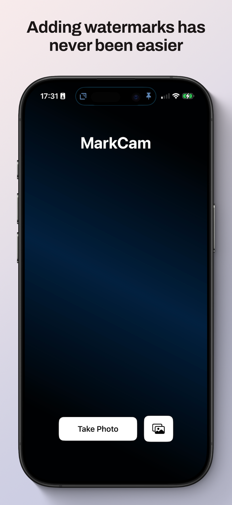

<!-- Main -->

<!-- One -->
<section id="one">
  

    <h2>Privacy-First Photo Watermarking & Timestamp App</h2>
    

      MarkCam is the <b><a href="https://cdf1982.com/privacy/markcam_terms_of_service_and_privacy_policy">privacy-first</a> tool for watermarking your photos</b> with custom text, timestamps, and GPS coordinates. Say goodbye to overpriced subscriptions and intrusive ads: MarkCam lets you <b>overlay the information you need, quickly and privately</b>.
    

		

			
		

    <h3>WHY MARKCAM?</h3>
    

      You just want to add a clean watermark or timestamp. But you don't want to see ads, pay weekly subscriptions or risk your privacy.
      I got tired of those things too, so I built MarkCam: <b>fast, focused, and refreshingly honest watermarking</b>.
    

    <h3>ONE-TIME PURCHASE, LIFETIME ACCESS</h3>
    <ul>
      <li><b>No subscriptions. No ads. No analytics. No catch.</b></li>
      <li>Try everything for free—the only limitation is a subtle upgrade message in the watermark.</li>
      <li>When you're ready, unlock the full version with a single, affordable purchase that's yours forever and shareable with your entire family via Family Sharing.</li>
    </ul>

    <h3>PRIVATE BY DESIGN</h3>
    <ul>
      <li>MarkCam works <b>entirely offline</b> and never sends data to any server.</li>
      <li><b>No tracking, no analytics, no hidden behavior.</b></li>
      <li>Your photos stay on your device, always.</li>
    </ul>

    <h3>PROFESSIONAL TOOLS, MADE SIMPLE</h3>
    <ul>
      <li><b>Text Watermarks</b> — Add custom text with your preferred font, color, and size</li>
      <li><b>Timestamps</b> — Automatically insert date and time in multiple formats</li>
      <li><b>GPS Coordinates</b> — Show exact coordinates or human-readable location</li>
      <li><b>Flexible Positioning</b> — Place your watermark in any of 9 positions</li>
      <li><b>Fully Customizable</b> — Adjust opacity, font, size, and background to fit your needs</li>
    </ul>

    

      Whether you're a contractor, lawyer, investigator, creator—or just someone who needs clean, date-stamped photos—MarkCam gives you the essential tools to document projects, prove when and where a photo was taken, and protect your content. All in a native, fast, and distraction-free app.
    

    

      <h3>Download MarkCam today and experience watermarking that's simple, honest, and built to last:</h3>
    

    

			
		

  

</section>

<!-- Screenshots gallery -->

  
  
  
  
  

