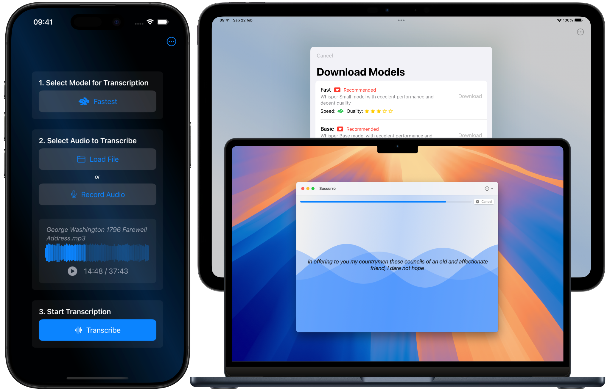

<!-- Main -->

<!-- One -->
<section id="one">
  

    <h2>Private AI Speech-to-Text Transcription on Your Device</h2>
    

      Sussurro <i>(Italian for Whisper)</i> lets you <b>convert audio to text using cutting-edge Artificial Intelligence</b> models, entirely on your device. <b>No data leaves your Mac, iPhone, or iPad</b> — no audio uploads, no transcriptions stored externally, and absolutely no analytics. Just <b>seamless, secure transcription of great quality with total privacy.</b>
    

		

			
			
			
		

    <h3>WHY CHOOSE SUSSURRO?</h3>
    <ul>
      <li><b>Complete Privacy:</b> Everything happens on your device. Your audio and text stay yours, always.</li>
      <li><b>Powered by Whisper:</b> Sussurro downloads and runs locally OpenAI’s state-of-the-art Whisper models for accurate speech-to-text transcription.</li>
      <li><b>Works On All Your Apple devices:</b> The app works natively on Mac, iPhone, and iPad, and is optimized for Apple silicon and the Neural Engine for fast, efficient processing.</li>
    </ul>

    <h3>FAST AND ACCURATE SPEECH RECOGNITION</h3>
    <ul>
      <li><b>Choose Your Model:</b> Select from multiple AI models to balance speed and accuracy according to your needs. Sussurro makes model selection simple and easy to understand — no AI expertise required.</li>
      <li><b>Transcribe offline:</b> Download models in-app and, once you get them the first time, you won't need any Internet connectivity.</li>
    </ul>

    <h3>WORK YOUR WAY</h3>
    <ul>
      <li>Load and transcribe existing audio files.</li>
      <li>Capture audio directly within the app and transcribe it right away.</li>
      <li>When you're done transcribing, copy, save to file or share text to any application.</li>
    </ul>

    <h3>TRY FOR FREE, WITH AN INEXPENSIVE ONE-TIME PURCHASE UNLOCK</h3>
    <ul>
      <li><b>Free to Test:</b> Preview any model with complete real-time transcription during processing. The free version shows the first 300 characters of the final transcription.</li>
      <li><b>One-Time Purchase:</b> Unlock unlimited transcription capabilities across all your Apple devices with a single, affordable in-app purchase — NO SUBSCRIPTIONS, no hidden fees. Plus, Family Sharing support means your family members get full access, too.</li>
    </ul>

    <h3>WHAT ELSE YOU NEED TO KNOW:</h3>
    <ul>
      <li>Sussurro Privacy Policy and Terms of use are written by a human (me, Cesare, hi!) to be read by other humans. And you should read it: <a href="https://cdf1982.com/privacy/sussurro_terms_of_service_and_privacy_policy">Privacy Policy and Terms</a>.</li>
      <li>Sussurro relies on OpenAI's Whisper models, which are distributed under the MIT license. However, OpenAI is neither involved nor affiliated with this app.</li>
      <li>Whisper models can be quite large; download them only when you won't incur costs from your provider.</li>
      <li>Transcription speed depends on your device performance and the model you choose.</li>
      <li>Accuracy greatly depends on the source audio quality and the model chosen for transcription.</li>
      <li>Transcriptions may include errors, including significant mistakes.</li>
      <li>Sussurro does not separate different speakers and does not format the output text.</li>
    </ul>

    

      <h3>Download Sussurro today and transcribe with confidence — privately, efficiently, and forever:</h3>
    

    

			
			
			
		

  

</section>

