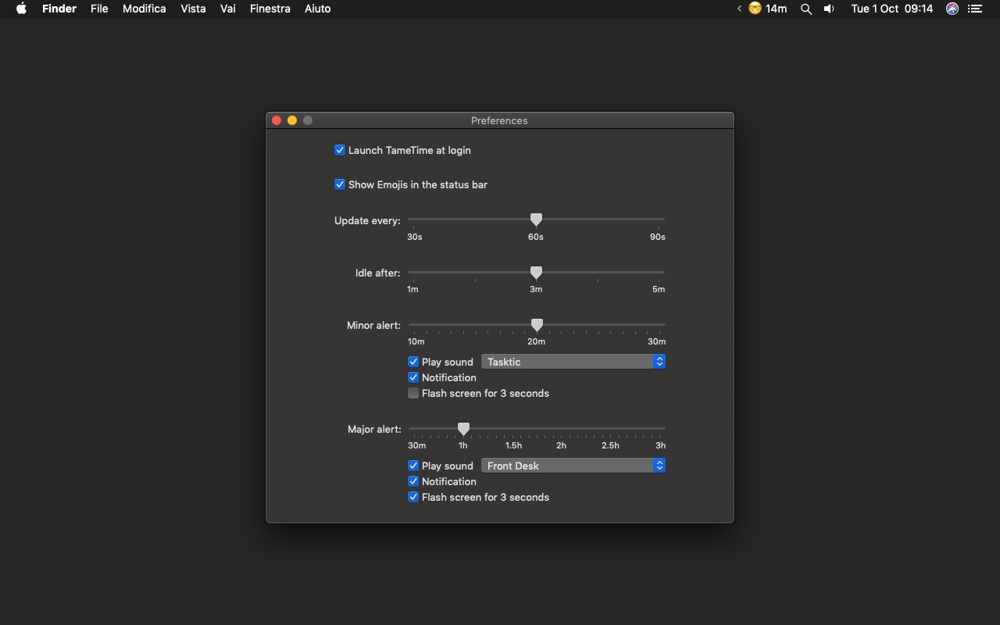

<!-- Main -->

<!-- One -->
<section id="one">
	

		
<b>TameTime reminds you of taking regular breaks, so that you don't spend too much time sitting at your computer and risk compromising your health.</b> You can customize how and when TameTime will alert you, making you aware that it's time to move around, drink a glass of water or relax.  RSI <i>(repetitive strain injuries)</i>, CVS <i>(computer vision syndrome)</i> and other computer-related stress are actual risk factors for modern workers and <b>taking regular breaks is very important for the well-being of your back, eyes, cardio-circulatory system, neck, muscles</b> and so on; pauses are also essential for refreshing your mind and <b>boost focus and productivity</b> throughout the day.  TameTime can help you build healthier habits!

		

			
		

	

</section>

<!-- Two -->
<section id="two" class="spotlights">
	<section>
		

			
		

		

			

				

					<ul>
						<li>TameTime <b>sits in your menu bar displaying the current session duration</b> in minutes and hours, with optional emojis 😊 that show at a glance how you're doing.</li>
						 
						<li>You can set <b>two thresholds for alerts</b> (for instance, after 25 minutes and 1 hour), each one independent from the other.</li>
						 
						<li>When the time limit is reached for a specific threshold, the app can play a <b>sound</b> (select one of TameTime's custom tones or a system sound), fire a <b>notification</b> and even display a <b>3-seconds full-screen overlay</b>; you can choose any combination of those alerts, or none at all.</li>
						 
						<li>You can also have the app repeat the notifications at multiples of your thresholds, for those time when you are so focused, you sit for 3 hours straight...</li>
						<li>TameTime detects the breaks you take naturally during the day and resets its timers automatically after a customizable delay: you never need to interact directly with the app to say that you're taking a pause or that you have resumed your work.</li>
						<li>TameTime never locks you out of your computer: it's up to you to take advantage of the awareness it provides, or to keep working hard for a little longer.</li>
						<li>When you don't want to be distracted by TameTime's alerts, for instance while making conference calls, you can manually pause the alerts while keeping the timer running, so that you don't lose track of the time spent even while using Zoom!</li>
					</ul>
				

			

		

	</section>
	
	<!-- Three -->
		<section>
			

				
			

			

				

					

						<ul>
							<li>TameTime <b>detects the breaks you take naturally during the day</b> and resets its timers automatically after a customizable delay: you never need to interact directly with the app to say that you're taking a pause or that you have resumed your work.</li>
							 
							<li>The app <b>never locks you out of your computer</b>: it's up to you to take advantage of the awareness it provides, or to keep working hard for a little longer.</li>
						</ul>
					

				

			

		</section>
	
	<section>
		

			
		

		

			

				

					TameTime can launch automatically when your Mac starts, does not require special permissions, uses almost no CPU or memory resources, and is very modern: it is compatible and fully at home on macOS Sequoia (including support for Dark Mode and native compatibility with Apple Silicon), but also works on older versions of macOS up to 10.14 Mojave; the app is native, built with the latest version of Swift, and does not include any analytics framework or other privacy-invading stuff (please see the <a href="{{ site.baseurl }}/privacy/tametime_privacy_policy.html">Privacy Policy</a>).  
					Please be advised that <b>TameTime is not a medical device and does not offer medical advice</b>; <b>if you're experiencing discomfort or pain, please don't hesitate to consult a doctor.</b>
				

			

		

	</section>
	<section>
		

			
		

		

			

				

					TameTime in an <i>indie</i> app that does not include in-app purchases or subscriptions: you just buy the app once (<b>thank you!</b>) for a very convenient price and <b>keep it forever on all your Macs</b> while also supporting its future development.  
					Support is available from the developer - me, Cesare - at <a href="mailto:support@cdf1982.com">support@cdf1982.com</a> and your reviews and word of mouth are really, really appreciated!
				

			

		

	</section>
</section>

