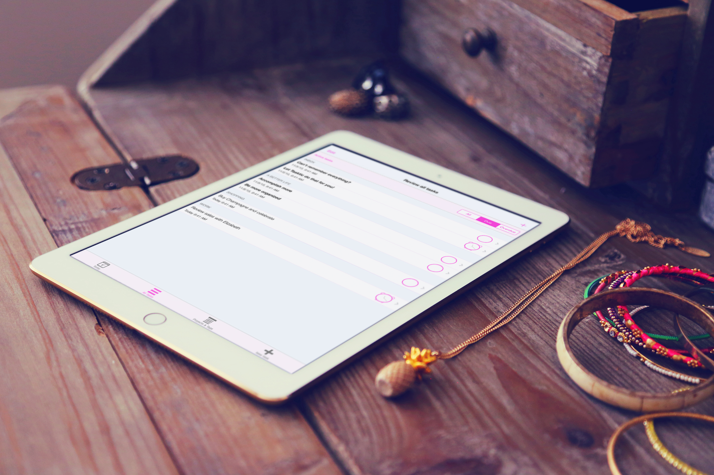
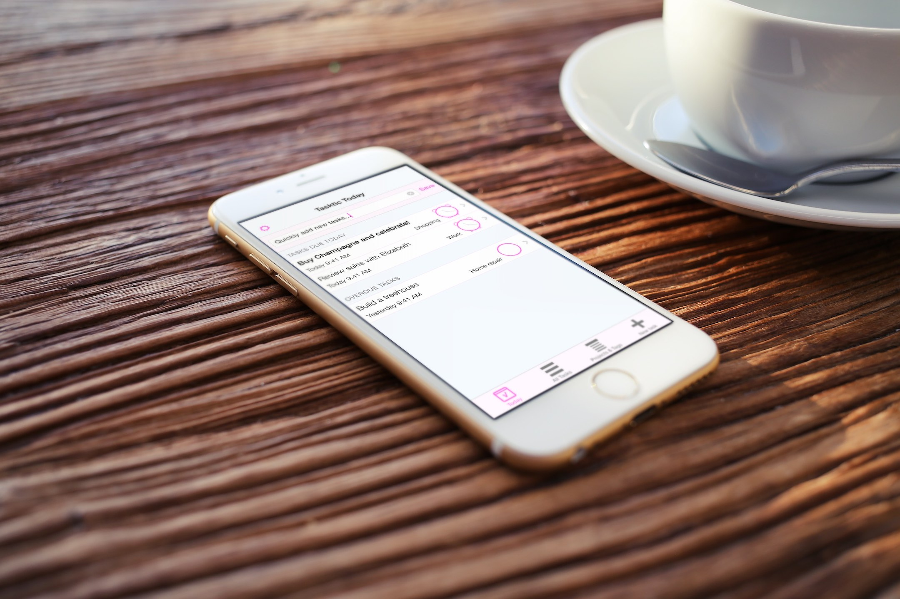
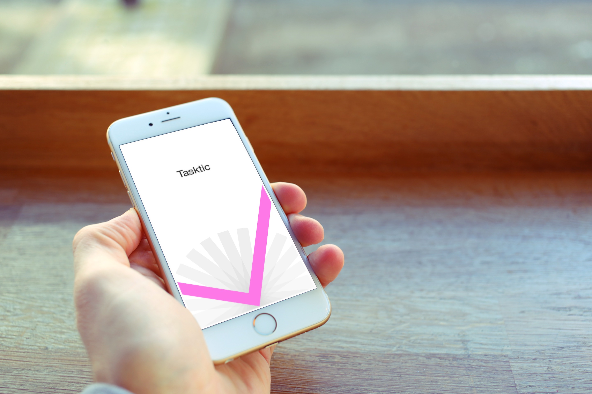

<!-- Main -->

<section id="one" class="spotlights">
	<section>
		

			<iframe src="https://player.vimeo.com/video/143538641" width="320" height="569" frameborder="0" webkitallowfullscreen mozallowfullscreen allowfullscreen></iframe>
		

		

			

				
Tasktic is our <b>ideal task manager for iPhone, iPad and Apple Watch.</b> and we're confident soon it will be yours too: many productivity apps are expensive and yet offer little functionality or too many useless complications. We worked hard to get just the right balance.  Tasktic is <b>lightning-fast</b> to launch and use: it immediately <b>focus on what you planned to get done</b> today - and that thing you scheduled for last week but slipped because it's not like you enjoy doing it - and lets you <b>quickly add new tasks</b> (and even <b>repeat them</b> every <i>n</i> hours, days, weekdays or months). Everything you add <b>syncs auto-magically on all your mobile devices</b>, thanks to iCloud.  We built Tasktic to be the fastest, easiest and most enjoyable way to free your mind of all the things you want and maybe <i>have</i> to do.  <b>Your next task?<a href="https://geo.itunes.apple.com/us/app/tasktic-manage-your-tasks/id1036139076?mt=8&at=1000l3L9&ct=website" class="link" target="new"> Try Tasktic</a> for free and start accomplishing more!</b>

				 
				 
				

					
					
				

			

		

	</section>
</section>

<!-- Two -->
<section id="two">
	

		<h3>Don't try to remember everything...</h3>
		
... probably you won't anyway. And that's a good thing: do you really want your brain to focus on remembering a list of things to do, or actually get them done?

		
By default, when you <strong>quickly </strong><strong>add a task</strong> to Tasktic, that new task goes into your Inbox... but you can also create as many <strong>projects</strong> as you need (<em>family, work, books, shopping, trip to Italy...</em>), <strong>mark what's important</strong>, add <strong>tags</strong>&nbsp;(<em>Christina, John, calls to make,&nbsp;novel ideas, kitty, whatever...</em>) and <strong>d</strong><strong>etailed notes </strong>with automatic conversion of phone numbers, addresses, email and web addresses into actionable links.

		
Every task can have an optional <strong>due date</strong> and, when you choose so, a <strong>notification</strong> (with a custom, subtle and elegant sound).

		
And there's more:&nbsp;with our <strong>Siri and Reminders for Mac integration</strong>,&nbsp;adding new tasks will be effortless and fast, as it will be from most of your other apps thanks to <strong>Tasktic Share Extension</strong>.&nbsp;Reviewing your next tasks will also never require much time with <strong>Tasktic Today</strong>&nbsp;in Notification Center, and you can also use Tasktic right on your wrist, with <strong>Tasktic for Apple Watch</strong>!

	

</section>

<!-- Three -->
<section id="three">
	

		<h3>Your external brain, always with you</h3>
		
We designed Tasktic to fit perfectly into the lifestyle of people who have never used an app like this before, as well as of experts of time-management methods. In both cases,&nbsp;you won't need to spend much time in Tasktic: you'll just start doing more things and be more relaxed!

		
Tasktic has a secret up its sleeve: <strong>fanTasktic button</strong>, an adaptive button so intuitive we don't need to say anything else. You'll love to mark things done!

		
To <strong>keep you motivated</strong>, Tasktic will provide useful <strong>statistics</strong> and will optionally reward your <strong>achievements</strong>&nbsp;with virtual awards.

		
Tasktic is a <strong>universal app for iPhone, iPad </strong>(with multitasking support)<strong> and Apple Watch</strong> that takes advantage of the power of iCloud to securely <strong>sync all your tasks, projects and tags </strong>between your devices.

		
Since privacy means a lot to us, we built Tasktic around a straightforward <a href="/privacy/tasktic_privacy_policy.html">privacy policy</a>&nbsp;we'd love you to read.

	

</section>

		
